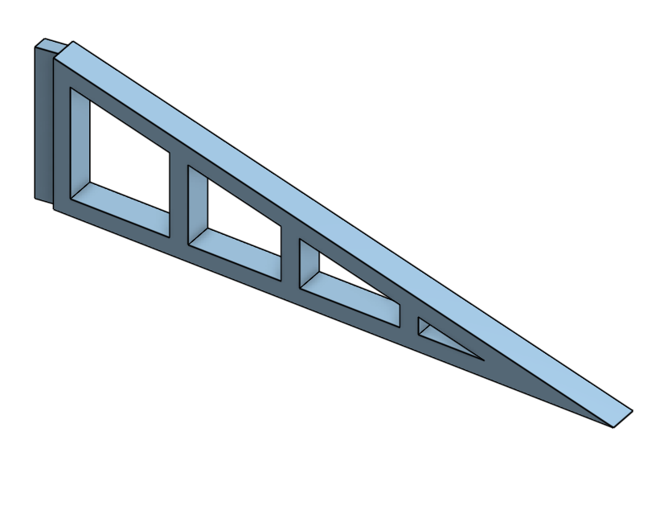
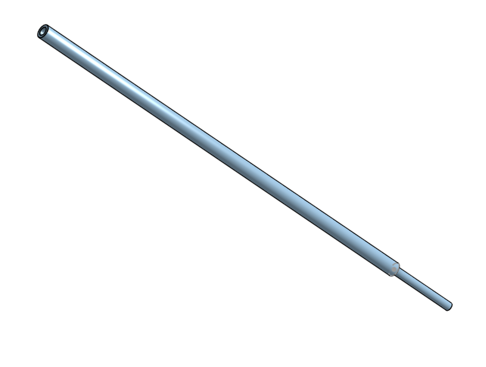

# Custom Drone
This project was by far my favorite. It had the best end product, and I got to combine so many disciplines. I did a lot of electrical engineering, some mechanical work on the hardware, 3D-printed some custom mounts and did lots of online shopping for parts. The project got me even deeper into the RC world, and it was so modular that I felt like I could do anything and go anywhere with it. 

| **Engineer** | **School** | **Area of Interest** | **Grade** |
|:--:|:--:|:--:|:--:|
| Tripp T. | Los Gatos High School | Aerospace/Mechanical Engineering | Rising Senior |

## [Back To Homepage](./index.md)

# First Milestone
<iframe width="560" height="315" src="https://www.youtube.com/embed/cRPAQWzwTPM?si=8zcl0T2SV0Ht0J9L" title="YouTube video player" frameborder="0" allow="accelerometer; autoplay; clipboard-write; encrypted-media; gyroscope; picture-in-picture; web-share" referrerpolicy="strict-origin-when-cross-origin" allowfullscreen></iframe>

**Overview**\
For this first milestone, it was about getting the drone up in the air, whatever that meant. So while the drone lacked a lot of capabilities or cool features, it could fly, and that was a good start. 

**Accomplishments**\
My main accomplishment is building a drone. I had never worked with such complicated electronics before, and this was a difficult but rewarding introduction. I became quite good at soldering, learned how to use a multimeter to check all my connections, and importantly I started to understand the ins and outs of electrical engineering. 

**Challenges**\
The biggest challenge had to be soldering. I had soldered a little before this project, however it was no where to the degree of this projects volume or complexity. There were so many joints that I had to create and often they were in hard to reach places. However, I feel I have become quite capable with the soldering iron and I know that will serve me well for the future. 

**Next Step**\
For my next milestone, I plan to integrate a camera system so I can film my flights. I'm hoping I can attach a GoPro to the drone in order to record the views the drone sees. 

# Second Milestone
<!---For your second milestone, explain what you've worked on since your previous milestone. You can highlight:
- Technical details of what you've accomplished and how they contribute to the final goal
- What has been surprising about the project so far
- Previous challenges you faced that you overcame
- What needs to be completed before your final milestone--> 
<iframe width="560" height="315" src="https://www.youtube.com/embed/3wA4xzai6so?si=yb6nTVmsfMpsDycW" title="YouTube video player" frameborder="0" allow="accelerometer; autoplay; clipboard-write; encrypted-media; gyroscope; picture-in-picture; web-share" referrerpolicy="strict-origin-when-cross-origin" allowfullscreen></iframe>

**Overview**\
This is the second milestone of my model rocket. This milestone was about learning to launch the rocket and then, in turn, learning from what works and what does not to make my final model. 

**Accomplishments**\
The main accomplishment of this milestone was the launch of the rocket. While it may have failed miserably, it was clear what went wrong. The rocket needs a bigger engine, balance, and weight loss. I had never worked with model rocket engines or launch controllers, so not setting anything on fire was also a huge plus.

**Challenges**\
The biggest challenge of this milestone was understanding the launch components. I extensively tested the engine, starter, and controller to ensure I knew what I was doing before going out in the field and setting things ablaze.

**Next Step**\
My next step is to design and 3D print all the parts I want for the final prototype. I want multiple components, like the nose cone and fins, to be both lighter and more precise, so I plan on making some designs for those. 

# Final Milestone

<iframe width="560" height="315" src="https://www.youtube.com/embed/7Dy2yKRyk_c?si=bA4rlciMUSBTVUgt" title="YouTube video player" frameborder="0" allow="accelerometer; autoplay; clipboard-write; encrypted-media; gyroscope; picture-in-picture; web-share" referrerpolicy="strict-origin-when-cross-origin" allowfullscreen></iframe>

**Overview**\
This is the Final milestone of my foam 3D-printed model rocket. I successfully launched it and deployed the parachute for this milestone. 

**Accomplishments**\
Since the prior milestone, I've revamped almost the whole rocket. The body is shorter. I made a new nose cone and new fins, and I remade the engine compartment. I've attached all the STL files for it below, and I think its because of the added precision and the dropped weight that allowed for a successful mission. 

**Challenges**\
The biggest challenge for this milestone was designing and printing the parts. I wasted a lot of time trying to figure out the best precision to print out the designs at. I started at just a millimeter, but had to move it up to 2.5 mm as the perfect combination of precision and room for error. It was also really hard learning to design and print a screw mechanism for the engine bay. 

**Next Step**\
For now, I am done with this project. However, in the future I want to increase the autonomous abilities of the drone.

# 3D Print Files

## Drone STLs

|**GoPro Mount**|**FPV Camera Stand**|
|:--:|:--:|:--:|
|||

# Bill of Materials

| **Part** | **Note** | **Price** | **Link** |
|:--:|:--:|:--:|:--:| 
|Model Rocket Engine|B-4-4|$11.99| <a href= "https://estesrockets.com/products/b4-4-engines"> Link </a>|
| Launch Controller | Low Cost Estes | $24.99 | <a href= "https://www.amazon.com/Estes-2230-E-Launch-Controller/dp/B0006MZKG6/ref=sr_1_1?dib=eyJ2IjoiMSJ9.pZynRK8k40zzOngTFx5Ye23KorYDbsOOKIs242or4JUbNwKRsrRk5xrBtnzAKkLaVLRpxyG4zdVom_2Bd5Uo0vsQZ09WVWXLlXz0oD7TD6ENXT3As3g34V8RrxQlGpoKgDpnaJIoSxhRqv3OAOBzCl2Ey8Pq_CBP0oHSIscMbcpv3WmtrtNuzNbtcRQ-iAYpCNFcTEstOD6co0Vp9EVzrBS0FjbDSNQkaKSDMNR5rQaEYy0KNcT0nBbAX2ADEKag5nECBybL-tskD0NLtsTcAIZfeu9m61ffPsLvgvC9k8.FUdjbPPH7V9ovpLtKm4GGI3ffvkMTEVdoWCo0qzqg&dib_tag=se&keywords=launch+controller+for+model+rockets&qid=1719594312&sr=8-1"> Link </a> |
|Golf Tubing|For Rocket Body|$19.99| <a href="https://www.amazon.com/sk=golf+tubes&crid=HUGNKQXWLLUU&sprefix=golf+tube%2Caps%2C163&ref=nb_sb_noss_1"> Link </a>|
|Parachute|For Recovery|$8.99|<a href="https://www.amazon.com/Estes-2265-15-Parachute/dp/B00A4UXATY/ref=sr_1_5?crid=1V63U10AA549L&dib=eyJ2IjoiMSJ9.Bomfzm68ELMGa0ug6PVQdctUuf75xW5w5Peg82NHoXkwXYeTNNeHHlo7E_Mjwh8yD7U-HHk3cJk90iPa_0KLz25BvWXO61TkdiSh8VKdUedg3JW6gHa9PpML4aa3o_kASNUKkFtODDT7qjkbNbLEBrhRbuKdJ-35BfNWgMIEFs8I7OxQscqoF--pdNSfmaavdXL_UM4A9lSnlLgtki4jfBWOAowQ7ecckYfXM8A2YL_LwkZamTs5U1G23yzalfBRCCBljqQSBrssDYAtFtTGvBlODXBDxo7JqX71M1TNlyM.tsX5eJwmDNW_qJo5Z4nxGWmCAbNdE3bAzy0OMi2tDP8&dib_tag=se&keywords=model+rocket+parachute&qid=1719594606&sprefix=model+rocket+para%2Caps%2C163&sr=8-5"> Link </a>|

|**Miscellaneous Parts/Tools**| **Note**|
|:--:|:--:|
|3D Printed Parts|Around $5 in PLA|

# Other Resources/Examples
- <a href="https://www.youtube.com/watch?v=r2lDXoW78u0"> Design Inspiration </a>

