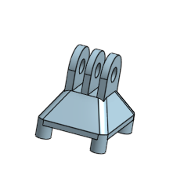

# Custom Drone
This project was by far my favorite. It had the best end product, and I got to combine so many disciplines. I did a lot of electrical engineering, some mechanical work on the hardware, 3D-printed some custom mounts and did lots of online shopping for parts. The project got me even deeper into the RC world, and it was so modular that I felt like I could do anything and go anywhere with it. 

| **Engineer** | **School** | **Area of Interest** | **Grade** |
|:--:|:--:|:--:|:--:|
| Tripp T. | Los Gatos High School | Aerospace/Mechanical Engineering | Rising Senior |

## [Back To Homepage](./index.md)

# First Milestone
<iframe width="560" height="315" src="https://www.youtube.com/embed/cRPAQWzwTPM?si=8zcl0T2SV0Ht0J9L" title="YouTube video player" frameborder="0" allow="accelerometer; autoplay; clipboard-write; encrypted-media; gyroscope; picture-in-picture; web-share" referrerpolicy="strict-origin-when-cross-origin" allowfullscreen></iframe>

**Overview**\
For this first milestone, it was about getting the drone up in the air, whatever that meant. So while the drone lacked a lot of capabilities or cool features, it could fly, and that was a good start. 

**Accomplishments**\
My main accomplishment is building a drone. I had never worked with such complicated electronics before, and this was a difficult but rewarding introduction. I became quite good at soldering, learned how to use a multimeter to check all my connections, and importantly I started to understand the ins and outs of electrical engineering. 

**Challenges**\
The biggest challenge had to be soldering. I had soldered a little before this project, however it was no where to the degree of this projects volume or complexity. There were so many joints that I had to create and often they were in hard to reach places. However, I feel I have become quite capable with the soldering iron and I know that will serve me well for the future. 

**Next Step**\
For my next milestone, I plan to integrate a camera system so I can film my flights. I'm hoping I can attach a GoPro to the drone in order to record the views the drone sees. 

# Second Milestone
<!---For your second milestone, explain what you've worked on since your previous milestone. You can highlight:
- Technical details of what you've accomplished and how they contribute to the final goal
- What has been surprising about the project so far
- Previous challenges you faced that you overcame
- What needs to be completed before your final milestone--> 
<iframe width="560" height="315" src="https://www.youtube.com/embed/3wA4xzai6so?si=yb6nTVmsfMpsDycW" title="YouTube video player" frameborder="0" allow="accelerometer; autoplay; clipboard-write; encrypted-media; gyroscope; picture-in-picture; web-share" referrerpolicy="strict-origin-when-cross-origin" allowfullscreen></iframe>

**Overview**\
This is the second milestone of my drone. This milestone was about trying to film my flights. I knew that a GoPro would easily provide high quality film so I decided to try and integrate it into my build.  

**Accomplishments**\
The accomplishment of this build was designing and 3D printing a mount for a GoPro. It took many iterations to get the right tolerances and design but when the GoPro finally fit and I collected my first footage it was an awesome feeling. 

**Challenges**\
The biggest challenge of this milestone was weight. The added mass of the GoPro depleted the battery of the drone much quicker than expected, this meant that I had to order a bigger battery and find ways I could cut weight on other parts of the drone. 

**Next Step**\
My next step is to integrate an FPV camera into the build that is capable of feeding me live footage of the flight that I can view through a FPV headset. 

# Final Milestone

<iframe width="560" height="315" src="https://www.youtube.com/embed/7Dy2yKRyk_c?si=bA4rlciMUSBTVUgt" title="YouTube video player" frameborder="0" allow="accelerometer; autoplay; clipboard-write; encrypted-media; gyroscope; picture-in-picture; web-share" referrerpolicy="strict-origin-when-cross-origin" allowfullscreen></iframe>

**Overview**\
This is the Final milestone of my drone. I successfully integrated within it a FPV system in which I can watch live the view from my drone as I fly it. 

**Accomplishments**\
The accomplishment of this milestone was adding an FPV system. I had to connect transmitters, solder on more wires, and find space for a camera on my already too-heavy drone. Overall, it was very cool to work with camera systems which was something completely new to me. Getting to fly the drone from a live view was also a feeling like no other that might piloting a drone much easier. 

**Challenges**\
The biggest challenge for this milestone was working with filming equipment. I had never worked with cameras and the electronics for these systems are very fragile and expensive. This meant I had to be extra careful while implementing the FPV systems. 

**Next Step**\
For now, I am done with this project. However, in the future I want to increase the autonomous abilities of the drone.

# 3D Print Files

## Drone STLs

|**GoPro Mount**|**FPV Camera Stand**|
|:--:|:--:|
|||

# Bill of Materials

| **Part** | **Note** | **Price** | **Link** |
|:--:|:--:|:--:|:--:| 
|Frame|250mm|$19.99| <a href= "https://tinyurl.com/5adnwn5k"> Link </a>|
|Motors| iFlight 2450 4-6S | $63.99 | <a href= "https://www.amazon.com/iFlight-2450KV-Brushless-Racing-Quadcopter/dp/B096RTCGDT/ref=sr_1_6?crid=3BFXSJ2M20BP2&dib=eyJ2IjoiMSJ9.Nn5t4vOg1oJ5njJkCQ4NKxCsWVxPlBi3B_QBNzj4XvsMrdJZ6gmFH1SZEuJ67_u1NUNklwMsF8V4X1y5l9sCmsUtMts5JFsX5NykjJmkOneGk8_1jKv7x0VipirnSIyat7M42_G5KqGNdSVHFTF2WiYUb1BAbw6ZiMwdOowuPS4J8UDlyApyClGmYHKYAgoJNjh51eD-C6HE_A02XtEgZLRgV-KwaW-KjyeNScuJfoXsiFamyyWNl0w8Bvy9wWjl4ZjGvPKQ7WGEJqmbMnSeYGCWvM5eMieJT6EE-3zqpx8.WslWjrvcRdIVv5KnV1ft82rA8hoYhJQ6xUdbIV2zbaM&dib_tag=se&keywords=T-Motor+F40+Pro+III+2306+2400KV&qid=1718304903&sprefix=t-motor+f40+pro+iii+2306+2400kv%2Caps%2C205&sr=8-6"> Link </a> |
|Props|3 Blade|$15.99| <a href="https://www.amazon.com/HQProp-5x4-3x3V2S-Tri-Blade-Propeller-Quadcopter-Multirotor/dp/B0C8NSPPPH/ref=sr_1_5?crid=1E7WIFRS7C4NF&dib=eyJ2IjoiMSJ9.gzgLHeMpvvFAL8awHB4A4-NO8K2p9SZ_wJkQnBcYr3XyOfKbNF2C5jDZbV_AGVZfz5RdPMs4K8A2-D0vKLVgdOmQ7ddpM7gTOw1DZgVXfTDzuxdIVXQw5AkkFBs6UK7SlVcL-g0t8IR6HT0g__3rqS8nKhfKAfL8sGMSdptFw7cYN1Q6PU9RLbE1U3pafQpA3B2TU0M-KBHGZFPmgHerH6_y3nfDo740aqDyDT-9CP1NZq7FWXLWFrQKmEhDN3G4m1-MD8aaHHBM65n6bTABg2Jjqpd3Xf1R9ZwS2PznScE.yqt2BxxdmH6sQa6zv1lVhJ0923p9yMGsbw7PW847_Vc&dib_tag=se&keywords=HQProp+DP+5x4.3x3&qid=1718305152&sprefix=%2Caps%2C173&sr=8-5"> Link </a>|
|Flight Controller/ESC|30x30mm|$65.99|<a href="https://www.speedybee.com/speedybee-f405-v4-bls-55a-30x30-fc-esc-stack/?gQT=1"> Link </a>|
|Battery|4500mah|$78.99|<a href="https://www.amazon.com/OVONIC-4500mAh-Battery-Evader-Airplane/dp/B07CV9M1BN/ref=sr_1_2_sspa?crid=1NEUW2RGVB1XU&dib=eyJ2IjoiMSJ9.xWG4CiqMDnIpgLnBCbGz8SLeQmZBPVMtVA-T9Q3-GfWaKQv07OfpwIp7IsSnfp1PNs31U8PTKRv4F7uhJIQWCf02zOr1cLTQ4cZG-8YEw-nnDxDKJA4crTsfuEqk7Kw6D0jeUba43JHvCKDHrMN690q_1Fn8DSDQN0RIUZYhPfQ8LeoVamex_RC4DjyGm8QRgPMjPTS6LhXJ7PL84A9avLV_sA_c5MrOIn_u-K-wbvA2CsK4frT1E5s1Otjcorfll2NH8-XNVfnQgrdtWgVh3tFLdfl7JlScDgwZnn6uItY.5vqhMnmSRxTRGThL5Ti_3984nStgXcJ-zpo7BaCqv7E&dib_tag=se&keywords=4500+mah+4s+lipo+battery&qid=1735797837&sprefix=4500+mah+4s+lipo+battery%2Caps%2C229&sr=8-2-spons&sp_csd=d2lkZ2V0TmFtZT1zcF9hdGY&psc=1"> Link </a>|
|FPV Camera|RunCam Phoenix 2: BY FAR the best budget FPV Camera|$35.99| <a href= "https://www.amazon.com/RunCam-Phoenix-Joshua-1000TVL-Freestyle/dp/B0C2VBLM7W/ref=pd_ci_mcx_pspc_dp_d_2_t_1?pd_rd_w=s0szj&content-id=amzn1.sym.568f3b6b-5aad-4bfd-98ee-d827f03151e4&pf_rd_p=568f3b6b-5aad-4bfd-98ee-d827f03151e4&pf_rd_r=Y12D8DYGH60EXGCA7CAK&pd_rd_wg=Gs2KC&pd_rd_r=d9bfad04-46e9-4f78-b6bf-c0972ccd0766&pd_rd_i=B0C2TK5JGR&th=1"> Link </a>|
|VTX|TBS|$39.99| <a href= "https://www.getfpv.com/tbs-unify-pro-5g8-v3-sma.html"> Link </a>|
|Antenna|Foxeer|$20.99| <a href= "https://www.amazon.com/Usmile-Lollipop-Antenna-Quadcopter-Transmitter/dp/B07T61ZJDP/ref=sr_1_1?crid=1O980WWMAUUXX&dib=eyJ2IjoiMSJ9.o80FAQjrO9fcYPNre3IB3Kb8agTnr6L6bgqMrPbM1CAUlDdLADuYphjJTcoKGzF7yqi85gpi0K6P-lip5kEkJE7gooPJy8B5WCJX_gv6fAyd7O5iwgayq4tsYiR8CnIFiyA7rdAfrcwBXSLzz14Umj_JZEn43YPyb_9VkCywerX2TmRIqe10ru0Sj1DN3C5I.xxbYB-t8Dsa1FsHQNmYRmaKMRRtYkj82JuPlljmWj6Q&dib_tag=se&keywords=Foxeer%2Blollipop%2B3&qid=1720398901&sprefix=foxeer%2Blollipop%2B3%2Caps%2C162&sr=8-1&th=1"> Link </a>|
|FPV Goggles|EV800D: Another GREAT budget option|$99.99| <a href= "https://www.getfpv.com/ev800d-5-8ghz-40ch-diversity-fpv-goggles-w-dvr.html"> Link </a>|
|RC Transmitter and Receiver|Same as the RC Plane|$55.99| <a href= "https://www.amazon.com/FLYSKY-Transmitter-Controller-ReceiverUpgrade/dp/B07Z8VCB45/ref=asc_df_B07Z8VCB45/tag=hyprod20&linkCode=df0&hvadid=693311371864&hvpos=&hvnetw=g&hvrand=11435024384380593492&hvpone=&hvptwo=&hvqmt=&hvdev=c&hvdvcmdl=&hvlocint=&hvlocphy=9032183&hvtargid=pla-1088447909254&psc=1&mcid=5511ea153e703c4388c5be8c069ed453&gad_source=1"> Link </a>|

|**Miscellaneous Parts/Tools**| **Note**|**Approximate Price**|
|:--:|:--:|:--:|
|3D Printed Parts|Not too much PLA for this build|$5|
|Heat Gun|Buy any model that works|$35|
|Heatshrinks|Ensure you buy/have different sizes|$10|
|Solder Wire|I ended up using ALOT of solder for this build|$20|
|GoPro|Depends on Model|$200-$400|
|GoPro Case/Mount|Make sure it can connect to other mounts|$10|

# Other Resources/Examples
- Joshua Bardwell's videos were HUGE in this project as he walked me through a lot of the more complex/niche parts of custom FPV building. Here's a link to his  <a href="https://www.youtube.com/channel/UCX3eufnI7A2I7IkKHZn8KSQ"> channel. </a>

