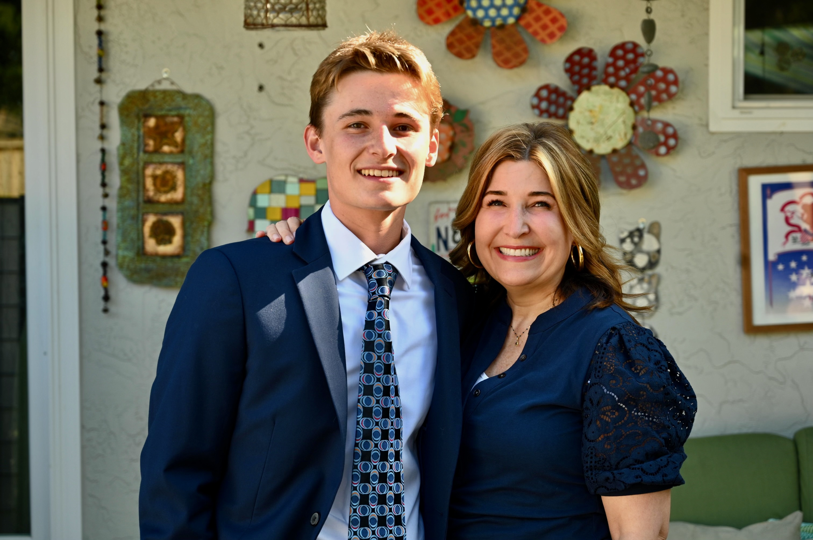

# Welcome to My Makers Portfolio

## About Me
Hi, I'm Tripp Thomas, a passionate maker and creator. I love building things that can bring satisfaction to my creative aspirations. My interests span various fields, including electronics, programming, 3D printing, and hardware. While many of my projects incorporate these various disciplines, I focus my interest mainly on Aerospace and Mechanical Engineering ventures. Explore my projects below to see what I've been working on.

## My Projects
Here are some of the projects I've been working on:

### Project 1: [RC Foam Airplane](./plane.md)
**Description:** I built this RC Airplane from a design I created. It has a foam body and various electronics, such as servos, an ESC, and a brushless motor, to help it go airborne. 

### Project 2: [Custom Drone](./drone.md)
**Description:** A brief description of your project. Highlight the key features and technologies used.

### Project 3: [Custom RC Car with Robotic Claw](./car.md)
**Description:** A brief description of your project. Highlight the key features and technologies used.

### Project 4: [3D Printed Model Rocket](./rocket.md)
**Description:** A brief description of your project. Highlight the key features and technologies used.

## Contact
Feel free to contact me on [LinkedIn](your_linkedin_profile), or via [email](mailto:geraldrtripp@gmail.com).

