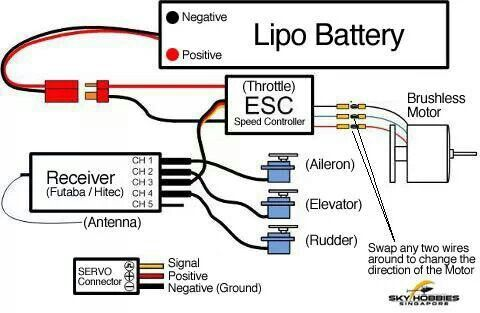

# 3D Printed Model Rocket
This project got me into the area of 3D printing. Through the power of some leftover money from an old job combined with the Christmas season, I ended up getting my hands on a new 3D printer. I was beyond excited because I could now start printing out my own parts for projects. Before this, I would have to scour my garage for cardboard and wood and make a shotty attempt at a design for something like a mount. Now I could use precision printing to do what felt like anything. I decided to make a model rocket and make all the complimentary parts out of PLA. It was super fun and it taught me so much about CAD and the intricacies of the software. 

| **Engineer** | **School** | **Area of Interest** | **Grade** |
|:--:|:--:|:--:|:--:|
| Tripp T. | Los Gatos High School | Aerospace/Mechanical Engineering | Junior |

## [Back To Homepage](./index.md)

# First Milestone
<iframe width="560" height="315" src="https://www.youtube.com/embed/eLJ4wtRUJ0Q?si=9Z-wYppHN6apqz7H" title="YouTube video player" frameborder="0" allow="accelerometer; autoplay; clipboard-write; encrypted-media; gyroscope; picture-in-picture; web-share" referrerpolicy="strict-origin-when-cross-origin" allowfullscreen></iframe>

**Overview**\
For this first milestone, it was about building a prototype. I wanted to see if my ideas would work in practice, so I just took any junk I could find and tested to see if it would work. 

**Accomplishments**\
My main accomplishment is designing a model rocket from scratch. I took cardboard, golf club tubing, push pins, plastic champagne flutes, anything I could find to build a prototype. It did not need to be the most aerodynamic object in the world, I just wanted to test my theories and see if I could put something quick and simple together. 

**Challenges**\
The biggest challenge had to be the integrating. I took all these incompatible parts, and I had to find a way to put them all together. It was a super fun challenge trying to be creative in new ways to get everything to work. 

**Next Step**\
For my next milestone, I plan to launch the rocket, see what works and what doesn't, and from there, see what parts I should design and 3D print for model two. 

# Second Milestone
<!---For your second milestone, explain what you've worked on since your previous milestone. You can highlight:
- Technical details of what you've accomplished and how they contribute to the final goal
- What has been surprising about the project so far
- Previous challenges you faced that you overcame
- What needs to be completed before your final milestone--> 
<iframe width="560" height="315" src="https://www.youtube.com/embed/OAdHz1ghlD0?si=6XIEqs8O4W4EaHot" title="YouTube video player" frameborder="0" allow="accelerometer; autoplay; clipboard-write; encrypted-media; gyroscope; picture-in-picture; web-share" referrerpolicy="strict-origin-when-cross-origin" allowfullscreen></iframe>

**Overview**\
This is the second milestone of my foam RC Plane. For this milestone I am making solid attempts at flight, but still struggling to get consistently up in the air.

**Accomplishments**\
Some technical accomplishments I've made are that the hardware and electronics for the plane are done. I have the design down, so even if I were to crash and break it, I could rebuild it, and it would work. Since the first iteration, I made a couple of switches that might not be obvious. First, I made the front sturdier to hold the propeller in properly. By combining screws, glue, and a solid piece of wood, I was able to make a solid place for the motor to attach to. I've also made some organizational changes within the chassis. I had problems with the battery sliding back and unplugging or shifting the center of gravity while in the air, so I made a system using wooden dowels that kept the battery firmly in place.

**Challenges**\
The biggest challenge so far has been take-offs. I cannot consistently set up a way for myself to get up in the air and actually practice flying around. Every time I go out to fly, I try to take off, and for the most part, the plane just floats down, hits the ground, and breaks off its propeller. 

**Next Step**\
Before I can say I am done with this project, I want sustained flight. No matter how I take off it does not matter, if my plane is in the air and I am in control, I am happy and I can say I am done. 

# Final Milestone

<iframe width="560" height="315" src="https://www.youtube.com/embed/ec7b5v9FoI8?si=OXt-W_M7n9x_Szlu" title="YouTube video player" frameborder="0" allow="accelerometer; autoplay; clipboard-write; encrypted-media; gyroscope; picture-in-picture; web-share" referrerpolicy="strict-origin-when-cross-origin" allowfullscreen></iframe>

**Overview**\
This is the Final milestone of my foam RC Plane. For this milestone I made a great attempt at flight and had sustained airtime, enough to satisfy my needs. 

**Accomplishments**\
Since the prior milestone, I've made only a few changes to the plane. I made better compartments that let me easily access the inside, change things up if needed, or plug things back in. I also added weights to the front of the plane to better balance the center of gravity and make things more aerodynamic. Finally, I spent time in an online flight simulator to practice my skills in a more controlled environment. 

**Challenges**\
The biggest challenge of this part was controlling the plane in air. I got my take-offs to be more consistent, but once I had a flight, I had no idea what to do, and it took a long time to get some semblance of control. 

**Next Step**\
For now, I am done with the plane. I want to move on to other projects that I have in mind, but in the future, I do want to come back to it by either building another better-looking and performing model or just adding some features like a cargo bay to the existing prototype. 

# RC Wiring Diagram

# Bill of Materials

| **Part** | **Note** | **Price** | **Link** |
|:--:|:--:|:--:|:--:| 
|Brushless RC Motor|Motor for Plane|$16.99| <a href= "https://www.amazon.com/FLASH-HOBBY-Brushless-Multicopters-Helicopter/dp/B089YN9WM9/ref=sr_1_4?crid=2N1L4C3VMAL3L&keywords=rc%2Bmotor&qid=1689274087&s=toys-and-games&sprefix=rc%2Bmoto%2Ctoys-and-games%2C163&sr=1-4&th=1"> Link </a>|
| 30A ESC | Speed Controller | $16.99 | <a href= "https://www.amazon.com/RC-Brushless-Electric-Controller-bullet/dp/B071GRSFBD/ref=pd_bxgy_sccl_1/130-2510493-2350145?pd_rd_w=Tpt7i&content-id=amzn1.sym.26a5c67f-1a30-486b-bb90-b523ad38d5a0&pf_rd_p=26a5c67f-1a30-486b-bb90-b523ad38d5a0&pf_rd_r=BWF4MRYYFR352B441YN7&pd_rd_wg=c4Kas&pd_rd_r=55405d14-455a-41be-95ae-b7396496c584&pd_rd_i=B071GRSFBD&psc=1"> Link </a> |
|RC Transmitter and Receiver|Controller for the Plane|$55.99| <a href= "https://www.amazon.com/FLYSKY-Transmitter-Controller-ReceiverUpgrade/dp/B07Z8VCB45/ref=asc_df_B07Z8VCB45/tag=hyprod20&linkCode=df0&hvadid=693311371864&hvpos=&hvnetw=g&hvrand=11435024384380593492&hvpone=&hvptwo=&hvqmt=&hvdev=c&hvdvcmdl=&hvlocint=&hvlocphy=9032183&hvtargid=pla-1088447909254&psc=1&mcid=5511ea153e703c4388c5be8c069ed453&gad_source=1"> Link </a>|
|10 pc Servos| Servos for Elevator and Rudder | $18.99 | <a href="https://www.amazon.com/Smraza-Helicopter-Airplane-Control-Arduino/dp/B07L2SF3R4/ref=sr_1_4?crid=2POL45TEUW4&dib=eyJ2IjoiMSJ9.1_WMN8TnuC1saC398n-qI5stCSQHi8o99msGSDDxL2zm7zTwqArq9Haxm6-dPkY4u0u7nfhcnMVKqwPX1LWaXD5enoeMKCW7TffNX9KScFx5PPDxh9Qq0AJHLT9QlOls5LrQucwz-17KyiQ5B65C6XhUBvkjgi8FtUvRaLzyP3uDVJC1H1coJhlH1534CA93cabK3bBtXmQnODrzOGHMJ4VHaz70rUJ5njq41MBRdwFMQuIiUTxoX4r6pajpS-4ZT_7DZx1XT0_cueVRlae7EMi7-ARQWac2bWEttdZklpU.xtCOtC6si7PFJAjjJmEaHLPV2y0Bik1MknRVT188K1A&dib_tag=se&keywords=servos&qid=1719420120&s=toys-and-games&sprefix=servos%2Ctoys-and-games%2C136&sr=1-4&th=1"> Link </a> |
| 20x30 Foam Board | For building Plane Body | $5.99/pc |<a href="https://www.michaels.com/product/20-x-30-white-foam-board-10110205?michaelsStore=3340&inv=93"> Link </a> |
|2200mAh 3S Lipo Battery (2 Count) |For Powering Plane|$28.99|<a href="https://www.amazon.com/CNHL-2200mAh-Battery-Airplane-Quadcopter/dp/B08KD1YN9F/ref=sr_1_5_pp?crid=27WM5D7VOGY03&dib=eyJ2IjoiMSJ9.x2TCcQBNLj9ew7DEv4HGLWG-K5FDudg1GrHocf0wd5_eUWPE7YTnosMVTjM1-O2ecbcMbwK8mbKg7hNFdtsGKxM-xmQwNI_lYNHvUU2t_TbtDz50syPYPG-fVAnqaGwn7Sx6Y1dCaHmnuMoMXv_u83sX0OqEou8l1SdeYmw0IF8OeBXc2DgvPaM53jzwvG0OjpgOfJyGpakl24YXKZ24FMCwQxqggZy960l7WKkvFSByDuOn0uwhsZSsla9mmz3AnBxEzOkL5mepSPJ4fVnaDhvcFoTFm6mVfoNxWr16bX4.dtJjND3QzEJJXImTbEyl5nBAGX7kRNa9Ffc4ipC0TIc&dib_tag=se&keywords=LiPo+battery&qid=1719421510&sprefix=lipo+battery%2Caps%2C162&sr=8-5"> Link </a>|

|**Miscellaneous Parts/Tools**| **Note**|
|:--:|:--:|
|Wooden Dowels|Help Fasten Wing|
|Rubber Bands|Help Fasten Wing|
|Hot Glue|Hold Things Together|
|LiPo Charger|Charge Battery|
|Xacto Knife|For Cutting and Folding Foam Board|

# Other Resources/Examples
- <a href="https://www.instructables.com/Beginners-Guide-to-Connecting-Your-RC-Plane-Electr/"> Parts and Wiring Tutorial </a>
