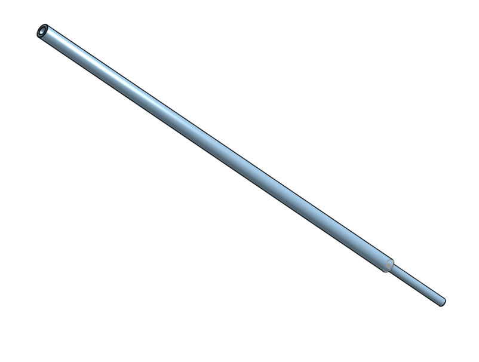

# 3D Printed Model Rocket
This project got me into the area of 3D printing. Through the power of some leftover money from an old job combined with the Christmas season, I ended up getting my hands on a new 3D printer. I was beyond excited because I could now start printing out my parts for projects. Before this, I would have to scour my garage for cardboard and wood and make a shotty attempt at a design for something like a mount. Now, I could use precision printing to do what felt like anything. I decided to make a model rocket and make all the complimentary parts out of PLA. It was super fun and it taught me so much about CAD and the intricacies of the software. 

| **Engineer** | **School** | **Area of Interest** | **Grade** |
|:--:|:--:|:--:|:--:|
| Tripp T. | Los Gatos High School | Aerospace/Mechanical Engineering | Junior |

## [Back To Homepage](./index.md)

# First Milestone
<iframe width="560" height="315" src="https://www.youtube.com/embed/eLJ4wtRUJ0Q?si=9Z-wYppHN6apqz7H" title="YouTube video player" frameborder="0" allow="accelerometer; autoplay; clipboard-write; encrypted-media; gyroscope; picture-in-picture; web-share" referrerpolicy="strict-origin-when-cross-origin" allowfullscreen></iframe>

**Overview**\
For this first milestone, it was about building a prototype. I wanted to see if my ideas would work in practice, so I just took any junk I could find and tested to see if it would work. 

**Accomplishments**\
My main accomplishment is designing a model rocket from scratch. I took cardboard, golf club tubing, push pins, plastic champagne flutes, anything I could find to build a prototype. It did not need to be the most aerodynamic object in the world, I just wanted to test my theories and see if I could put something quick and simple together. 

**Challenges**\
The biggest challenge had to be integrating. I took all these incompatible parts and had to find a way to put them all together. It was a super fun challenge to try to be creative in new ways to get everything to work. 

**Next Step**\
For my next milestone, I plan to launch the rocket, see what works and what doesn't, and from there, see what parts I should design and 3D print for model two. 

# Second Milestone
<!---For your second milestone, explain what you've worked on since your previous milestone. You can highlight:
- Technical details of what you've accomplished and how they contribute to the final goal
- What has been surprising about the project so far
- Previous challenges you faced that you overcame
- What needs to be completed before your final milestone--> 
<iframe width="560" height="315" src="https://www.youtube.com/embed/OAdHz1ghlD0?si=6XIEqs8O4W4EaHot" title="YouTube video player" frameborder="0" allow="accelerometer; autoplay; clipboard-write; encrypted-media; gyroscope; picture-in-picture; web-share" referrerpolicy="strict-origin-when-cross-origin" allowfullscreen></iframe>

**Overview**\
This is the second milestone of my model rocket. This milestone was about learning to launch the rocket and then, in turn, learning from what works and what does not to make my final model. 

**Accomplishments**\
The main accomplishment of this milestone was the launch of the rocket. While it may have failed miserably, it was clear what went wrong. The rocket needs a bigger engine, balance, and weight loss. I had never worked with model rocket engines or launch controllers, so not setting anything on fire was also a huge plus.

**Challenges**\
The biggest challenge of this milestone was understanding the launch components. I extensively tested the engine, starter, and controller to ensure I knew what I was doing before going out in the field and setting things ablaze.

**Next Step**\
My next step is to design and 3D print all the parts I want for the final prototype. I want multiple components, like the nose cone and fins, to be both lighter and more precise, so I plan on making some designs for those. 

# Final Milestone

<iframe width="560" height="315" src="https://www.youtube.com/embed/ec7b5v9FoI8?si=OXt-W_M7n9x_Szlu" title="YouTube video player" frameborder="0" allow="accelerometer; autoplay; clipboard-write; encrypted-media; gyroscope; picture-in-picture; web-share" referrerpolicy="strict-origin-when-cross-origin" allowfullscreen></iframe>

**Overview**\
This is the Final milestone of my foam 3D-printed model rocket. I successfully launched it and deployed the parachute for this milestone. 

**Accomplishments**\
Since the prior milestone, I've revamped almost the whole rocket. The body is shorter. I made a new nose cone and new fins, and I remade the engine compartment. I've attached all the STL files for it below, and I think its because of the added precision and the dropped weight that allowed for a successful mission. 

**Challenges**\
The biggest challenge for this milestone was designing and printing the parts. I wasted a lot of time trying to figure out the best precision to print out the designs at. I started at just a millimeter, but had to move it up to 2.5 mm as the perfect combination of precision and room for error. It was also really hard learning to design and print a screw mechanism for the engine bay. 

**Next Step**\
For now, I am done with the rocket. I want to move on to other projects that I have in mind, like building a drone, but in the future, I do want to come back to it by adding a way for both the rocket and nose cone to come down safely.

# 3D Print Files

## Launch Pad STLs

|**Leg Stand**|**Launch Rail**|**Mount**|
|:--:|:--:|:--:|
||||
|**Center Console**|**Cover**|**Assembly**|
||||

## Model Rocket STLs

|**Nose Cone**|**Fins**|**Launch Rail Guide**|
|:--:|:--:|:--:|
||||
|**Engine Holder**|**Holder Screw Top**|**Engine Holder Animation**|
||||

# Bill of Materials

| **Part** | **Note** | **Price** | **Link** |
|:--:|:--:|:--:|:--:| 
|Model Rocket Engine|B-4-4|$11.99| <a href= "https://estesrockets.com/products/b4-4-engines"> Link </a>|
| Launch Controller | Low Cost Estes | $24.99 | <a href= "https://www.amazon.com/Estes-2230-E-Launch-Controller/dp/B0006MZKG6/ref=sr_1_1?dib=eyJ2IjoiMSJ9.pZynRK8k40zzOngTFx5Ye23KorYDbsOOKIs242or4JUbNwKRsrRk5xrBtnzAKkLaVLRpxyG4zdVom_2Bd5Uo0vsQZ09WVWXLlXz0oD7TD6ENXT3As3g34V8RrxQlGpoKgDpnaJIoSxhRqv3OAOBzCl2Ey8Pq_CBP0oHSIscMbcpv3WmtrtNuzNbtcRQ-iAYpCNFcTEstOD6co0Vp9EVzrBS0FjbDSNQkaKSDMNR5rQaEYy0KNcT0nBbAX2ADEKag5nECBybL-tskD0NLtsTcAIZfeu9m61ffPsLvgvC9k8.FUdjbPPH7V9ovpLtKm4GGI3ffvkMTEVdoWCo0qzqg&dib_tag=se&keywords=launch+controller+for+model+rockets&qid=1719594312&sr=8-1"> Link </a> |
|Golf Tubing|For Rocket Body|$19.99| <a href="https://www.amazon.com/sk=golf+tubes&crid=HUGNKQXWLLUU&sprefix=golf+tube%2Caps%2C163&ref=nb_sb_noss_1"> Link </a>|
|Parachute|For Recovery|$8.99|<a href="https://www.amazon.com/Estes-2265-15-Parachute/dp/B00A4UXATY/ref=sr_1_5?crid=1V63U10AA549L&dib=eyJ2IjoiMSJ9.Bomfzm68ELMGa0ug6PVQdctUuf75xW5w5Peg82NHoXkwXYeTNNeHHlo7E_Mjwh8yD7U-HHk3cJk90iPa_0KLz25BvWXO61TkdiSh8VKdUedg3JW6gHa9PpML4aa3o_kASNUKkFtODDT7qjkbNbLEBrhRbuKdJ-35BfNWgMIEFs8I7OxQscqoF--pdNSfmaavdXL_UM4A9lSnlLgtki4jfBWOAowQ7ecckYfXM8A2YL_LwkZamTs5U1G23yzalfBRCCBljqQSBrssDYAtFtTGvBlODXBDxo7JqX71M1TNlyM.tsX5eJwmDNW_qJo5Z4nxGWmCAbNdE3bAzy0OMi2tDP8&dib_tag=se&keywords=model+rocket+parachute&qid=1719594606&sprefix=model+rocket+para%2Caps%2C163&sr=8-5"> Link </a>|

|**Miscellaneous Parts/Tools**| **Note**|
|:--:|:--:|
|3D Printed Parts|Around $10 in PLA|

# Other Resources/Examples
- <a href="https://www.youtube.com/watch?v=r2lDXoW78u0"> Design Inspiration </a>
